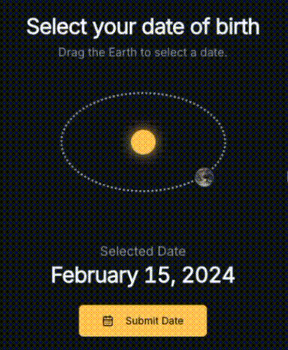

# Orbital Date Picker 🌍🛸

A joke demo app featuring the world's most unnecessarily complex date picker component. Instead of boring old calendars, dates orbit around Earth like celestial bodies in space. Because why make date selection simple when you can make it astronomical?

## 🚀 What is this?

This is a satirical take on overly complex UI components. The Orbital Date Picker represents dates as orbiting elements around a central point (Earth), forcing users to click on moving targets to select a date. It's essentially a date picker designed by someone who thinks traditional calendars are "too easy."

## 🎮 Demo

**Live Demo:** [https://studio--studio-6503600075-46ee6.us-central1.hosted.app/](https://studio--studio-6503600075-46ee6.us-central1.hosted.app/)



## 🛠️ Built With

This magnificently over-engineered date picker was created using **Vibe Coding** with [Firebase Studio](https://firebase.google.com/products/studio).

### Tech Stack

- **Next.js** - React framework
- **TypeScript** - Type safety for our orbital calculations
- **Tailwind CSS** - Styling
- **shadcn/ui** - UI component library
- **Firebase App Hosting** - Deployment

## 🎯 Features

- ✨ Dates that orbit in space (because why not?)
- 🌍 Earth at the center (geocentric model approved)
- 🎪 Makes simple date selection an adventure
- 🤷‍♂️ Guaranteed to confuse users
- 😅 Perfect example of "just because you can, doesn't mean you should"

## 🏃 Running Locally

```bash
# Install dependencies
npm install

# Run development server
npm run dev
```

## License

MIT
